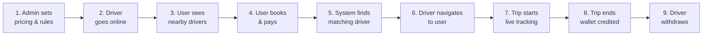

# SpareDriver — Final Implementation Plan (v4)

> **This document is the complete end-to-end blueprint.** No code will be written until you approve. Once approved, we build phase by phase.

---

## Confirmed Decisions

| Decision | Answer |
|----------|--------|
| Payment flow | Pre-payment — user pays before ride starts |
| Ride type | Driver comes to user's car — driver has no own car |
| Pricing scope | Global — not zone-based |
| Commission | Admin-configurable % — platform takes percentage of each ride |
| Service charge & GST | Admin-controlled — configurable from admin panel |
| Cancellation | Admin-configurable 10-20% deduction on user cancel, ₹ penalty on driver cancel |
| No driver available | Alert ops team — they push incentive notifications to attract offline drivers |
| Withdrawal | Admin-approved — manual approval before payout |
| Min withdrawal | Yes — admin-configurable minimum amount |

---

## End-to-End Flow Summary



---

## Phase 1 — Admin Pricing & Rules Setup

**Goal**: Admin configures service types, time slabs, extra charges, GST, service charge, commission, cancellation fees, and subscription plans.

### 1.1 Service Pricing Model

Three service types, each with time-slab pricing:

#### Point-to-Point
| Slab | Example Price |
|------|--------------|
| Up to 1 Hour | ₹299 |
| 1–2 Hours | ₹499 |
| 2–4 Hours | ₹799 |
| 4–6 Hours | ₹999 |

#### Hourly Packages
| Duration | Example Price |
|----------|--------------|
| 1 Hour | ₹199 |
| 2 Hours | ₹349 |
| 3 Hours | ₹499 |
| 4 Hours | ₹699 |

#### Half-Day Packages
| Duration | Example Price |
|----------|--------------|
| 4 Hours | ₹699 |
| 6 Hours | ₹999 |

### 1.2 Backend — New Files

#### [NEW] `backend/src/models/servicePricing.model.js`

```js
{
  serviceType: 'point_to_point' | 'hourly' | 'half_day',
  name: String,                    // "Point-to-Point", "Hourly Package"
  description: String,
  icon: String,

  // Time slabs (admin adds/removes dynamically)
  slabs: [{
    label: String,                 // "Up to 1 Hour"
    minHours: Number,              // 0
    maxHours: Number,              // 1
    price: Number,                 // 299
    sortOrder: Number,
  }],

  // Extra charges
  extraHourCharge: Number,         // ₹ per extra hour beyond slab

  waitingCharge: {
    freeWaitingMinutes: Number,    // 15 min free
    chargePerMinute: Number,       // ₹2/min after
  },

  nightCharge: {
    enabled: Boolean,
    startTime: String,             // "22:00"
    endTime: String,               // "06:00"
    type: 'flat' | 'percentage',
    amount: Number,                // ₹ or %
  },

  tollParkingEnabled: Boolean,     // driver can add during trip

  // Food allowance (half-day only)
  foodAllowance: {
    enabled: Boolean,
    amount: Number,                // ₹ added if customer doesn't provide food
  },

  // Platform charges (all admin-configurable)
  serviceChargePercent: Number,    // platform service charge %
  gstPercent: Number,              // GST % (default 18)
  platformCommissionPercent: Number, // % platform takes from driver earning

  // Cancellation policy
  cancellation: {
    userCancellationFeePercent: Number, // 10-20%
    driverCancellationPenalty: Number,  // ₹ flat
    freeCancellationMinutes: Number,    // free cancel window (e.g., 2 min)
  },

  // Driver search config
  driverSearch: {
    searchTimeoutMinutes: Number,  // time before alerting ops (e.g., 5 min)
    searchRadiusKm: Number,        // radius to find drivers (e.g., 10 km)
    maxRetries: Number,            // max drivers to offer before giving up
  },

  isActive: Boolean,
  sortOrder: Number,
  createdBy: ObjectId → User,
}
```

#### [NEW] `backend/src/models/subscription.model.js`

```js
{
  name: String,                    // "Monthly Plan"
  durationMonths: Number,          // 1, 3, 6, 12
  price: Number,                   // ₹ subscription cost
  discountType: 'percentage' | 'flat',
  discountValue: Number,           // 10% or ₹50
  description: String,
  features: [String],              // bullet points for UI
  isActive: Boolean,
  sortOrder: Number,
  createdBy: ObjectId → User,
}
```

#### [NEW] `backend/src/models/userSubscription.model.js`

```js
{
  userId: ObjectId → User,
  planId: ObjectId → SubscriptionPlan,
  status: 'active' | 'expired' | 'cancelled',
  startDate: Date,
  expiryDate: Date,
  amount: Number,
  razorpayOrderId: String,
  razorpayPaymentId: String,
  // Snapshot of plan at purchase time
  discountType: String,
  discountValue: Number,
  durationMonths: Number,
}
```

#### [NEW] `backend/src/services/pricing.service.js`

**Fare calculation engine** — the core of the billing system:

```
Input: { serviceType, slabId, actualDurationMin, isNightRide,
         waitingMinutes, tollParking, foodProvided, userId }

Calculation:
  1. packagePrice = selected slab price
  2. extraHours  = max(0, ceil(actualDuration - slabMaxHours))
  3. extraHourCharge = extraHours × extraHourRate
  4. waitingCharge = max(0, waitingMin - freeMin) × chargePerMin
  5. nightCharge = nightAmount (if night hours apply)
  6. tollParking = amount added by driver
  7. foodAllowance = foodAmount (if half-day & customer doesn't provide food)
  8. subtotal = sum of above
  9. serviceCharge = subtotal × serviceChargePercent%
  10. gstAmount = (subtotal + serviceCharge) × gstPercent%
  11. subscriptionDiscount = apply if user has active subscription
  12. totalPayable = subtotal + serviceCharge + gstAmount - subscriptionDiscount
  13. platformCommission = subtotal × platformCommissionPercent%
  14. driverEarning = subtotal - platformCommission

Output: Complete fare breakdown object
```

#### [NEW] `backend/src/controllers/pricing.controller.js`

CRUD for service pricing and subscription plans.

### 1.3 Backend — Modified Files

#### [MODIFY] `backend/src/routes/admin.route.js`

```
POST   /api/v1/admin/pricing/services            → create service pricing
GET    /api/v1/admin/pricing/services            → list all
PUT    /api/v1/admin/pricing/services/:id        → update
DELETE /api/v1/admin/pricing/services/:id        → delete

POST   /api/v1/admin/pricing/subscriptions       → create subscription plan
GET    /api/v1/admin/pricing/subscriptions       → list all
PUT    /api/v1/admin/pricing/subscriptions/:id   → update
DELETE /api/v1/admin/pricing/subscriptions/:id   → delete
```

#### [MODIFY] `backend/src/routes/user.routes.js`

```
GET  /api/v1/auth/pricing/services        → active service types + slabs (booking UI)
GET  /api/v1/auth/pricing/subscriptions   → active subscription plans
POST /api/v1/auth/subscriptions/purchase   → buy subscription
GET  /api/v1/auth/subscriptions/active     → user's active subscription
```

### 1.4 Frontend — New Files

#### [NEW] `frontend/src/features/admin/pages/ManagePricing.jsx`

Admin pricing dashboard:
- Tab per service type (Point-to-Point / Hourly / Half-Day)
- Slab editor: add/remove/reorder time slabs with prices
- Extra charges section: waiting, night, toll, food allowance toggles & amounts
- Platform charges: service charge %, GST %, commission % inputs
- Cancellation config: fee %, driver penalty, free window
- Driver search config: timeout, radius, max retries
- Live fare preview calculator

#### [NEW] `frontend/src/features/admin/pages/ManageSubscriptions.jsx`

Subscription plans CRUD: name, duration, price, discount, features list.

### 1.5 Frontend — Modified Files

#### [MODIFY] `frontend/src/App.jsx`

```
/admin/settings/pricing       → ManagePricing
/admin/settings/subscriptions → ManageSubscriptions
```

---

## Phase 2 — Real-time Infrastructure (Socket.IO)

**Goal**: Set up Socket.IO for all real-time features.

### 2.1 Backend — New Files

#### [NEW] `backend/src/config/socket.js`

```
Socket.IO Server:
├── Auth middleware (verify JWT from handshake)
├── Rooms:
│   ├── driver:{driverId}     — per driver
│   ├── user:{userId}         — per user
│   ├── booking:{bookingId}   — shared booking room
│   └── admin:ops             — admin operations room
│
├── Driver Events (incoming):
│   ├── location:update       → { lat, lng }
│   ├── booking:accept        → { bookingId }
│   ├── booking:reject        → { bookingId }
│   ├── trip:status-update    → { bookingId, status }
│   └── trip:add-charge       → { bookingId, amount, type }
│
├── User Events (outgoing):
│   ├── booking:status        → status change notifications
│   ├── driver:location       → live driver position
│   └── trip:update           → trip progress
│
└── Admin Events (outgoing):
    └── ops:driver-shortage   → alert when no driver found
```

### 2.2 Backend — Modified Files

#### [MODIFY] `backend/src/server.js`

```diff
- app.listen(PORT, () => { ... });
+ const httpServer = createServer(app);
+ initializeSocket(httpServer);
+ httpServer.listen(PORT, () => { ... });
```

### 2.3 Dependencies

```bash
# Backend
npm install socket.io

# Frontend
npm install socket.io-client
```

---

## Phase 3 — Driver Goes Online + Location Broadcasting

**Goal**: When driver toggles online, start broadcasting GPS location.

### 3.1 Backend — New Files

#### [NEW] `backend/src/services/driverLocation.service.js`

```
updateDriverLocation(driverId, { lat, lng })
  → Update driver.location GeoJSON in MongoDB

findNearbyDrivers({ lat, lng, radiusKm, carTypeIds })
  → MongoDB $nearSphere + $geoWithin query
  → Filters: isOnline=true, isOnTrip=false, approvalStatus='approved',
             carTypeExperience includes any of carTypeIds
  → Returns: [{ _id, name, profilePicture, rating, distance, carTypeExperience }]
```

### 3.2 Backend — Modified Files

#### [MODIFY] `backend/src/services/driverOnline.service.js`

- On go online: save `socketId`, start expecting location updates
- On go offline: clear `socketId`, reset location to `[0,0]`

### 3.3 Frontend — New Files

#### [NEW] `frontend/src/hooks/useSocket.js`

```
Hook: useSocket(namespace)
  → Auto-connect with JWT token on mount
  → Auto-reconnect on disconnect
  → Returns: { socket, connected, emit, on, off }
  → Cleanup on unmount
```

#### [NEW] `frontend/src/hooks/useDriverLocation.js`

```
Hook: useDriverLocation(isOnline)
  → When online:
    1. navigator.geolocation.watchPosition()
    2. Emit 'location:update' via Socket.IO every 10 seconds
    3. Fallback: POST to REST API if socket disconnects
  → Returns: { currentPosition, tracking, error }
  → Stop tracking when offline
```

### 3.4 Frontend — Modified Files

#### [MODIFY] `frontend/src/features/driver/home/pages/DriverHomePage.jsx`

- On toggle ON → request Geolocation permission → start broadcasting
- Show real earnings from wallet API (replace hardcoded ₹850)
- Show real trip count and rating from API
- Listen for `booking:new-request` → navigate to booking request page

---

## Phase 4 — User Sees Nearby Drivers

**Goal**: User's home page shows matched drivers on a map.

### 4.1 Backend — New Files

#### [NEW] `backend/src/services/driverSearch.service.js`

```
searchDriversForUser(userId, { lat, lng, radiusKm })
  1. Fetch user's cars → extract unique carTypeId values
  2. Call findNearbyDrivers with those carTypeIds
  3. Score each driver:
     - Exact car type match (brand + model) → highest
     - Car type category match → medium
     - Distance (closer = better)
     - Rating (higher = better)
  4. Return sorted driver list with match info
```

### 4.2 Backend — Modified Files

#### [MODIFY] `backend/src/routes/user.routes.js`

```
GET /api/v1/auth/drivers/nearby?lat=X&lng=Y&radius=10
```

### 4.3 Frontend — Modified Files

#### [MODIFY] `frontend/src/features/user/home/pages/UserHomePage.jsx`

- Get user's current location
- Fetch nearby matched drivers from API
- Show Google Map with driver markers (car icon markers)
- Below map: driver cards (name, photo, rating, distance, matched car types)
- "Book a Driver" CTA button → enters booking flow

---

## Phase 5 — Booking Creation, Fare Calculation & Payment

**Goal**: User selects service → picks slab → reviews fare → pays via Razorpay → booking created.

### 5.1 Backend — New Files

#### [NEW] `backend/src/models/booking.model.js`

```js
{
  // Identity
  bookingNumber: String,           // "SD-10001" (auto-generated)
  userId: ObjectId → User,
  driverId: ObjectId → Driver,     // null until assigned
  carId: ObjectId → Car,           // user's car

  // Service
  serviceType: 'point_to_point' | 'hourly' | 'half_day',
  servicePricingId: ObjectId → ServicePricing,
  selectedSlabId: ObjectId,        // which slab user picked

  // Location
  pickupLocation: {
    type: 'Point',
    coordinates: [lng, lat],
    address: String,
  },
  dropLocation: { ... },           // same structure

  // Timing
  scheduledAt: Date,
  bookedDurationHours: Number,
  actualStartTime: Date,
  actualEndTime: Date,
  actualDurationMinutes: Number,

  // Status
  status: 'pending' | 'accepted' | 'driver_on_way' | 'driver_arrived'
        | 'in_progress' | 'completed' | 'cancelled' | 'no_driver',

  // Fare Breakdown (calculated by pricing engine)
  fareBreakdown: {
    packagePrice, extraHours, extraHourCharge,
    waitingMinutes, waitingCharge,
    nightCharge, tollParking, foodAllowance,
    subtotal, serviceCharge, serviceChargePercent,
    gstAmount, gstPercent,
    subscriptionDiscount,
    totalPayable,
    platformCommission, platformCommissionPercent,
    driverEarning,
  },

  // Food (half-day)
  foodProvidedByCustomer: Boolean,

  // Payment (pre-payment via Razorpay)
  payment: {
    status: 'pending' | 'paid' | 'refunded',
    razorpayOrderId, razorpayPaymentId, razorpaySignature,
    method, paidAt,
    // Extra charges (if actual > prepaid)
    extraPaymentOrderId, extraPaymentId,
    extraPaymentAmount, extraPaidAt,
  },

  // Cancellation
  cancellation: {
    cancelledBy: 'user' | 'driver' | 'system',
    cancelledAt: Date,
    reason: String,
    cancellationFee: Number,       // amount deducted from user
    refundAmount: Number,          // amount refunded
    refundStatus: 'pending' | 'processed' | 'failed',
    driverPenalty: Number,         // penalty from driver wallet
  },

  // Ops Alert (if no driver found)
  opsAlert: {
    alertSentAt, alertedTeamMembers,
    incentivePushSentAt, driversNotified,
    resolved, resolvedAt,
  },

  // Live tracking
  driverLocationHistory: [{ lat, lng, timestamp }],

  // OTP (user shares with driver to start trip)
  tripOtp: String,                 // 4-digit code

  // Ratings
  rating: {
    byUser: Number, byDriver: Number,
    userFeedback: String, driverFeedback: String,
  },

  // Subscription applied
  userSubscriptionId: ObjectId → UserSubscription,
}
```

#### [NEW] `backend/src/services/booking.service.js`

```
getEstimate({ serviceType, slabId, isNightRide, foodProvided, userId })
  → Calculate fare using pricing engine
  → Apply subscription discount if active
  → Return fareBreakdown (no booking created yet)

createBooking(userId, { serviceType, slabId, carId,
              pickupLocation, dropLocation, foodProvided, scheduledAt })
  1. Validate user's car exists and is active
  2. Fetch service pricing config + selected slab
  3. Calculate initial fare via pricing.service
  4. Create Razorpay order for totalPayable amount
  5. Generate 4-digit trip OTP
  6. Generate booking number (SD-XXXXX)
  7. Save booking: status='pending', payment.status='pending'
  8. Return { booking, razorpayOrder }

verifyBookingPayment(userId, { bookingId, razorpayOrderId,
                     razorpayPaymentId, razorpaySignature })
  1. Verify Razorpay signature (crypto.createHmac)
  2. Update payment: status='paid', paidAt=now
  3. Trigger assignDriverToBooking() → Phase 6
  4. Return { booking, paymentVerified: true }

completeTrip(bookingId, driverId, { actualDurationMin, waitingMin, tollParking })
  → LIVE TIME BILLING ENGINE:
  1. Determine which slab the actual time falls into
  2. Calculate extra hours: ceil(actualDuration - bookedHours)
     → Partial hours round UP to next full hour
  3. Recalculate full fare with actual values
  4. If actualFare > prepaidAmount → create extra Razorpay order
  5. If actualFare ≤ prepaidAmount → complete immediately
  6. Credit driverEarning to driver wallet (Phase 8)
  7. Update booking: status='completed', actualEndTime=now
  8. Broadcast via Socket.IO to user
```

#### [NEW] `backend/src/controllers/booking.controller.js`

### 5.2 Backend — Modified Files

#### [MODIFY] `backend/src/routes/user.routes.js`

```
POST /api/v1/auth/bookings/estimate          → fare estimate
POST /api/v1/auth/bookings                   → create booking
POST /api/v1/auth/bookings/:id/verify-payment → verify Razorpay payment
GET  /api/v1/auth/bookings/:id               → booking detail
GET  /api/v1/auth/bookings                   → booking history
POST /api/v1/auth/bookings/:id/cancel        → cancel booking
POST /api/v1/auth/bookings/:id/rate          → rate driver
```

#### [MODIFY] `backend/src/routes/driver.route.js`

```
GET  /api/v1/driver/bookings/active          → current active booking
POST /api/v1/driver/bookings/:id/accept      → accept booking
POST /api/v1/driver/bookings/:id/cancel      → driver cancels (penalty)
POST /api/v1/driver/bookings/:id/status      → update trip status
POST /api/v1/driver/bookings/:id/complete    → end trip with actual data
POST /api/v1/driver/bookings/:id/add-charge  → add toll/parking during trip
GET  /api/v1/driver/bookings                 → trip history
POST /api/v1/driver/bookings/:id/rate        → rate user
```

### 5.3 Frontend — New Files

#### [NEW] `frontend/src/store/useBookingStore.js`

Zustand store for the entire booking flow state:
```
{ selectedCar, serviceType, selectedSlab, pickupLocation,
  dropLocation, fareEstimate, activeBooking, foodProvided, scheduledAt }
```

### 5.4 Frontend — Modified Files (Wire static pages to real APIs)

#### [MODIFY] `frontend/src/features/user/booking/pages/SelectServicePage.jsx`

- Fetch active service types from `/pricing/services`
- Show 3 cards: Point-to-Point, Hourly, Half-Day (from API, not hardcoded)
- User selects their car (from user's registered cars)
- Save to booking store → navigate to duration page

#### [MODIFY] `frontend/src/features/user/booking/pages/SelectDurationPage.jsx`

- Show available time slabs for selected service type (from API)
- Google Places autocomplete for pickup & drop locations
- For half-day: food preference toggle ("I'll provide food" / "Add food allowance")
- Date/time picker for scheduled booking
- Save to store → navigate to review

#### [MODIFY] `frontend/src/features/user/booking/pages/ReviewBookingPage.jsx`

- Call `POST /bookings/estimate` with selected options
- Display real fare breakdown:
  ```
  Package Price (2 Hours)         ₹349
  Night Charge                    ₹50
  Food Allowance                  ₹0
  ─────────────────────────────────
  Subtotal                        ₹399
  Service Charge (5%)             ₹20
  GST (18%)                       ₹75
  Subscription Discount           -₹40
  ─────────────────────────────────
  Total Payable                   ₹454
  ```
- "Confirm & Pay ₹454" button → navigate to payment

#### [MODIFY] `frontend/src/features/user/booking/pages/PaymentPage.jsx`

- Call `POST /bookings` → get Razorpay order
- Open Razorpay checkout modal with order details
- On success → call `/bookings/:id/verify-payment`
- On verification success → navigate to SearchingDriverPage
- Replace current hardcoded mock with real integration

---

## Phase 6 — Driver Matching & Assignment

**Goal**: System finds the best matching driver after payment.

### 6.1 Backend Logic (in `booking.service.js`)

```
assignDriverToBooking(bookingId)
  1. Get booking → get user's car → extract carTypeId
  2. Get search config (timeout, radius, maxRetries)
  3. Find nearby online drivers matching car type
  4. Sort by: distance → rating → experience years
  5. Sequential offer loop:
     ┌─────────────────────────────────────────────────────────┐
     │  For each driver (nearest first):                       │
     │    a. Send Socket.IO 'booking:new-request' to driver   │
     │    b. Start 30-second countdown                         │
     │    c. If driver accepts:                                │
     │       → booking.driverId = driver._id                   │
     │       → booking.status = 'accepted'                     │
     │       → driver.isOnTrip = true                          │
     │       → driver.currentBookingId = booking._id           │
     │       → Notify user: 'booking:status' { accepted }     │
     │       → DONE ✅                                         │
     │    d. If rejected or 30s timeout:                       │
     │       → Try next driver                                 │
     └─────────────────────────────────────────────────────────┘
  6. If all drivers exhausted OR searchTimeout reached:
     → booking.status = 'no_driver'
     → Trigger ops alert (Phase 9)
     → Notify user: "No drivers available, team notified"
```

### 6.2 Frontend — Modified Files

#### [MODIFY] `frontend/src/features/user/booking/pages/SearchingDriverPage.jsx`

- Join Socket.IO room `booking:{bookingId}`
- Listen for `booking:status` events
- Show searching animation with pulsing radar
- On `accepted` → show driver info briefly → navigate to tracking
- On `no_driver` → show message: "Our team has been notified"
  - "Cancel & Get Full Refund" button
  - "Keep Waiting" option

#### [MODIFY] `frontend/src/features/user/booking/pages/DriverAssignedPage.jsx`

- Show driver details: name, photo, rating, car experience match
- Show driver's live location on mini-map
- "Cancel Booking" option (shows fee warning if past free period)
- Auto-navigate to tracking when `driver_on_way`

#### [MODIFY] `frontend/src/features/driver/trips/pages/NewBookingRequestPage.jsx`

- Triggered by Socket.IO `booking:new-request` event
- Show: user name, car (brand/model), pickup address, service type, driver earning amount
- 30-second countdown timer (circular progress)
- Accept ✅ / Reject ❌ buttons
- On accept → call API → navigate to NavigateToCustomerPage
- On timeout → auto-reject → wait for next request

---

## Phase 7 — Navigation + Live Trip Tracking

**Goal**: Real-time driver location on map for both driver and user.

### 7.1 Socket.IO Event Flow

```
 Timeline          Driver App              Server                  User App
 ────────          ──────────              ──────                  ────────

 T+0     Driver taps "Start Navigation"
         emit('trip:status',          → Update DB status       → 'booking:status'
           'driver_on_way')             to driver_on_way          {driver_on_way}
                                                                  → User sees map

 T+10s   emit('location:update',     → Save to history        → 'driver:location'
           { lat, lng })                                          { lat, lng, eta }

 T+20s   [... continues every 10s ...]

 T+15m   Driver taps "I've Arrived"
         emit('trip:status',          → Update DB              → 'booking:status'
           'driver_arrived')                                      {driver_arrived}
                                                                  → Show OTP screen

 T+16m   Driver enters OTP "4829"
         POST /verify-otp             → Validate against       → 'booking:status'
                                        booking.tripOtp           {in_progress}
         emit('trip:status',          → Set actualStartTime    → Trip timer starts
           'in_progress')

 T+30m   Driver taps "Add Toll ₹40"
         emit('trip:add-charge',      → Update fareBreakdown   → 'trip:extra-charge'
           { amount: 40, type: 'toll' })  .tollParking += 40       { toll: 40 }

 T+2h    Driver taps "End Trip"
         POST /complete               → Live Time Billing:     → 'booking:status'
           { actualDuration: 124,       Calculate final fare      {completed}
             waitingMin: 8,             Credit driver wallet      + fareBreakdown
             tollParking: 40 }          Generate invoice

 T+2h1m  Both rate each other
         POST /rate                    → Update ratings         → Done ✅
```

### 7.2 Frontend — Modified Driver Trip Pages

#### [MODIFY] `frontend/src/features/driver/trips/pages/NavigateToCustomerPage.jsx`
- Google Maps directions to pickup location
- Broadcast driver location every 10s via Socket.IO
- ETA display (from Google Directions API)
- "I've Arrived" button → emits `driver_arrived` status

#### [MODIFY] `frontend/src/features/driver/trips/pages/ArrivedStartTripPage.jsx`
- OTP input field (4 digits)
- Verify OTP matches `booking.tripOtp`
- "Start Trip" button (only enabled after OTP verified)
- Starts the ride timer

#### [MODIFY] `frontend/src/features/driver/trips/pages/DriverTripInProgressPage.jsx`
- Live map showing current route
- Running timer (elapsed hours:minutes)
- "Add Toll/Parking" button → modal to enter amount
- "End Trip" button → calls completeTrip API
- Continue broadcasting location

#### [MODIFY] `frontend/src/features/driver/trips/pages/DriverTripCompletedPage.jsx`
- Trip summary card:
  ```
  Booked: 2 Hours | Actual: 2h 4m
  Extra: 1 hour (rounded up)
  
  Your Earning: ₹380
  ```
- "Rate Customer" button → navigate to rate page

#### [MODIFY] `frontend/src/features/driver/trips/pages/RateCustomerPage.jsx`
- Star rating (1-5) + text feedback
- Submit → call `/bookings/:id/rate`

### 7.3 Frontend — Modified User Tracking Pages

#### [MODIFY] `frontend/src/features/user/tracking/pages/DriverOnWayPage.jsx`
- Live Google Map showing driver marker moving toward user
- ETA countdown
- Driver info card (name, photo, rating)
- "Cancel" option

#### [MODIFY] `frontend/src/features/user/tracking/pages/DriverReachedPage.jsx`
- Large OTP display: **"Share this OTP with your driver: 4829"**
- "Driver has arrived" confirmation
- Driver info card

#### [MODIFY] `frontend/src/features/user/tracking/pages/TripInProgressPage.jsx`
- Live map showing car location during trip
- Elapsed time counter
- Any extra charges added (toll/parking notifications)

#### [MODIFY] `frontend/src/features/user/tracking/pages/TripCompletedPage.jsx`
- Complete fare breakdown:
  ```
  Package (2 Hours)            ₹349
  Extra Time (1 hour)          ₹150
  Waiting (8 min)              ₹16
  Toll/Parking                 ₹40
  ─────────────────────────────
  Subtotal                     ₹555
  Service Charge (5%)          ₹28
  GST (18%)                    ₹105
  Subscription Discount        -₹50
  ─────────────────────────────
  Total                        ₹638
  Pre-paid                     ₹454
  Extra Due                    ₹184
  ```
- "Pay Extra ₹184" button (if applicable)
- "Rate Driver" button

#### [MODIFY] `frontend/src/features/user/tracking/pages/RatePayPage.jsx`
- Star rating + feedback
- If extra payment due → Razorpay checkout for remainder

#### [MODIFY] `frontend/src/features/user/tracking/pages/InvoicePage.jsx`
- Downloadable invoice with:
  - Booking number, date, timestamps
  - Complete fare breakdown with GST registration details
  - Payment method and transaction IDs

---

## Phase 8 — Driver Wallet, Earnings & Withdrawal

**Goal**: Credit driver after ride, track earnings, admin-approved withdrawals.

### 8.1 Backend — New Files

#### [NEW] `backend/src/models/walletTransaction.model.js`

```js
{
  driverId: ObjectId → Driver,
  type: 'credit' | 'debit',
  purpose: 'ride_earning' | 'withdrawal' | 'bonus' | 'penalty' | 'refund',
  amount: Number,
  bookingId: ObjectId → Booking,   // null for non-ride transactions
  balanceAfter: Number,
  description: String,
}
```

#### [NEW] `backend/src/models/withdrawal.model.js`

```js
{
  driverId: ObjectId → Driver,
  amount: Number,
  status: 'requested' | 'approved' | 'rejected',
  bankDetails: { accountNumber, ifscCode, accountHolderName },
  processedAt: Date,
  processedBy: ObjectId → User,    // admin
  rejectionReason: String,
  adminNote: String,
}
```

#### [NEW] `backend/src/services/wallet.service.js`

```
creditDriverEarning(driverId, bookingId, amount)
  → driver.wallet.balance += amount
  → driver.wallet.totalEarnings += amount
  → Create walletTransaction (credit, ride_earning)
  → Update driver.todaySummary

requestWithdrawal(driverId, amount)
  → Validate: amount ≥ minWithdrawalAmount
  → Validate: driver.wallet.balance ≥ amount
  → Debit wallet balance
  → Create withdrawal (status='requested')
  → Create admin task for review

processWithdrawal(withdrawalId, adminId, { approved, reason })
  → If approved: mark complete, driver.wallet.totalWithdrawn += amount
  → If rejected: refund to wallet, create credit transaction

getWalletSummary(driverId)
  → { balance, totalEarnings, totalWithdrawn, todayEarnings, todayTrips }

getTransactionHistory(driverId, { page, limit })
  → Paginated transaction list

getEarningsSummary(driverId, 'today' | 'week' | 'month')
  → { earnings, trips, averagePerTrip }
```

#### [NEW] `backend/src/controllers/wallet.controller.js`

### 8.2 Backend — Modified Files

#### [MODIFY] `backend/src/routes/driver.route.js`

```
GET  /api/v1/driver/wallet              → wallet summary
GET  /api/v1/driver/wallet/transactions → transaction history
POST /api/v1/driver/wallet/withdraw     → request withdrawal
GET  /api/v1/driver/wallet/withdrawals  → withdrawal history
GET  /api/v1/driver/earnings/summary    → earnings by period
```

#### [MODIFY] `backend/src/routes/admin.route.js`

```
GET  /api/v1/admin/withdrawals             → list withdrawal requests
POST /api/v1/admin/withdrawals/:id/process → approve or reject
```

### 8.3 Frontend — New Files

#### [NEW] `frontend/src/features/driver/earnings/pages/WithdrawalPage.jsx`

- Wallet balance card
- Enter withdrawal amount (shows min threshold)
- Bank details confirmation (from driver profile)
- Submit request
- Withdrawal history with status badges

#### [NEW] `frontend/src/features/admin/pages/ManageWithdrawals.jsx`

- Table: driver name, amount, bank details, requested date, status
- Filters: pending / approved / rejected
- Approve ✅ / Reject ❌ buttons with note

### 8.4 Frontend — Modified Files

#### [MODIFY] `frontend/src/features/driver/earnings/pages/EarningsPage.jsx`
- Real data: today / this week / this month earnings
- Wallet balance card with "Withdraw" button
- Recent transactions list

#### [MODIFY] `frontend/src/features/driver/home/pages/DriverHomePage.jsx`
- Real today's earnings and trip count from wallet API

#### [MODIFY] `frontend/src/features/driver/trips/pages/MyTripsPage.jsx`
- Real trip history from booking API (paginated)

#### [MODIFY] `frontend/src/App.jsx`
```
/driver/wallet/withdraw  → WithdrawalPage
/admin/withdrawals       → ManageWithdrawals
```

---

## Phase 9 — Cancellation & Operations Alert Dashboard

**Goal**: Handle cancellations with fee deduction, alert ops when no drivers available.

### 9.1 Cancellation Logic

#### User Cancels

```
┌─────────────────────────────────────────────────────────┐
│ User taps "Cancel Booking"                              │
│                                                         │
│ Is within freeCancellationMinutes (e.g., 2 min)?       │
│   YES → Full refund (₹454) → No fee                    │
│   NO  → Deduct cancellationFeePercent (e.g., 15%)      │
│         cancellationFee = ₹454 × 15% = ₹68             │
│         refundAmount = ₹454 - ₹68 = ₹386               │
│         → Initiate Razorpay refund for ₹386             │
│                                                         │
│ If driver was assigned → free driver (isOnTrip=false)   │
│ Notify driver via Socket.IO                             │
└─────────────────────────────────────────────────────────┘
```

#### Driver Cancels

```
┌─────────────────────────────────────────────────────────┐
│ Driver taps "Cancel Trip"                               │
│                                                         │
│ → Full refund to user (100% — not user's fault)         │
│ → Deduct ₹50 penalty from driver wallet                 │
│ → Create wallet transaction (debit, penalty)            │
│ → Try to reassign to another driver                     │
│ → If no driver found → trigger ops alert                │
│ → Notify user via Socket.IO                             │
└─────────────────────────────────────────────────────────┘
```

### 9.2 Operations Alert System

When no driver accepts a booking:

#### [NEW] `backend/src/models/opsAlert.model.js`

```js
{
  bookingId: ObjectId → Booking,
  type: 'no_driver_available',
  location: { type: 'Point', coordinates, address },
  carTypeRequired: ObjectId → CarType,
  driversSearched: Number,
  driversDeclined: Number,
  searchRadiusKm: Number,
  status: 'active' | 'incentive_sent' | 'resolved' | 'expired',
  incentive: {
    sentAt, sentBy, message, bonusAmount,
    driversNotified, radiusKm,
  },
  resolvedAt: Date,
  resolvedBy: ObjectId → User,
  resolution: 'driver_found' | 'user_cancelled' | 'expired',
}
```

#### [NEW] `backend/src/services/opsAlert.service.js`

```
createOpsAlert(bookingId, searchStats)
  → Create alert record
  → Create high-priority admin task
  → Emit 'ops:driver-shortage' to admin:ops Socket.IO room

sendIncentivePush(alertId, adminId, { message, bonusAmount, radiusKm })
  → Find offline approved drivers within expanded radius
  → Send push notification to each driver:
    "🚗 Earn ₹100 bonus! Rider waiting in Vijay Nagar. Go online now!"
  → Update alert: incentive details, driversNotified count

retryDriverSearch(alertId)
  → Re-run assignDriverToBooking with expanded radius
  → If driver found → resolve alert
```

#### [NEW] `backend/src/services/cancellation.service.js`

Handles all cancellation logic (user cancel, driver cancel, refund calculation).

#### [NEW] `backend/src/controllers/opsAlert.controller.js`

### 9.3 Backend — Modified Files

#### [MODIFY] `backend/src/routes/admin.route.js`

```
GET  /api/v1/admin/ops/alerts                → list active alerts
GET  /api/v1/admin/ops/alerts/:id            → alert detail
POST /api/v1/admin/ops/alerts/:id/incentive  → push incentive to drivers
POST /api/v1/admin/ops/alerts/:id/retry      → retry driver search
POST /api/v1/admin/ops/alerts/:id/resolve    → manually resolve
GET  /api/v1/admin/ops/stats                 → shortage statistics
```

### 9.4 Frontend — New Files

#### [NEW] `frontend/src/features/admin/pages/OpsAlertDashboard.jsx`

Real-time operations dashboard:
- **Live alert feed** — alerts appear in real-time via Socket.IO (🔔 sound)
- **Alert cards**: booking #, user name, car type, location map, time elapsed
- **Quick actions**:
  - 📢 "Send Incentive" → modal: message, bonus ₹, radius, driver count preview
  - 🔄 "Retry Search" → re-run driver matching
  - ✅ "Mark Resolved" → manual resolution
- **Stats bar**: active alerts, alerts today, avg resolution time
- **Shortage heatmap**: areas with frequent driver shortages

### 9.5 Frontend — Modified Files

#### [MODIFY] `frontend/src/App.jsx`

```
/admin/ops/alerts → OpsAlertDashboard
```

#### [MODIFY] Admin sidebar — add "Operations" section with alert badge

---

## Complete File Summary

### New Files (27)

| # | Path | Purpose |
|---|------|---------|
| 1 | `backend/src/models/servicePricing.model.js` | Service pricing with slabs + charges + cancellation + search config |
| 2 | `backend/src/models/subscription.model.js` | Subscription plan definitions |
| 3 | `backend/src/models/userSubscription.model.js` | User purchased subscriptions |
| 4 | `backend/src/models/booking.model.js` | Booking with fare breakdown + cancellation + ops alert |
| 5 | `backend/src/models/walletTransaction.model.js` | Driver wallet transaction log |
| 6 | `backend/src/models/withdrawal.model.js` | Driver withdrawal requests |
| 7 | `backend/src/models/opsAlert.model.js` | Ops alert for driver shortages |
| 8 | `backend/src/services/pricing.service.js` | Slab-based fare calculation engine |
| 9 | `backend/src/services/booking.service.js` | Booking lifecycle + driver matching |
| 10 | `backend/src/services/driverLocation.service.js` | GPS location + nearby search |
| 11 | `backend/src/services/driverSearch.service.js` | Car-type matched driver search |
| 12 | `backend/src/services/wallet.service.js` | Wallet credit/debit + withdrawal |
| 13 | `backend/src/services/cancellation.service.js` | Cancel with fee/penalty + refund |
| 14 | `backend/src/services/opsAlert.service.js` | Ops alert + incentive push |
| 15 | `backend/src/controllers/pricing.controller.js` | Pricing API handlers |
| 16 | `backend/src/controllers/booking.controller.js` | Booking API handlers |
| 17 | `backend/src/controllers/wallet.controller.js` | Wallet API handlers |
| 18 | `backend/src/controllers/opsAlert.controller.js` | Ops alert API handlers |
| 19 | `backend/src/config/socket.js` | Socket.IO server setup + auth |
| 20 | `frontend/src/hooks/useSocket.js` | Socket.IO React hook |
| 21 | `frontend/src/hooks/useDriverLocation.js` | GPS + Socket location hook |
| 22 | `frontend/src/store/useBookingStore.js` | Booking flow Zustand store |
| 23 | `frontend/src/features/driver/earnings/pages/WithdrawalPage.jsx` | Driver withdrawal UI |
| 24 | `frontend/src/features/admin/pages/ManagePricing.jsx` | Admin pricing management |
| 25 | `frontend/src/features/admin/pages/ManageSubscriptions.jsx` | Admin subscription plans |
| 26 | `frontend/src/features/admin/pages/ManageWithdrawals.jsx` | Admin withdrawal approval |
| 27 | `frontend/src/features/admin/pages/OpsAlertDashboard.jsx` | Ops real-time alert dashboard |

### Modified Files (~22)

| Category | Files |
|----------|-------|
| Backend Routes | `admin.route.js`, `user.routes.js`, `driver.route.js` |
| Backend Server | `server.js` |
| Backend Services | `driverOnline.service.js` |
| Frontend Routing | `App.jsx` |
| User Booking (6 pages) | SelectService, SelectDuration, ReviewBooking, Payment, SearchingDriver, DriverAssigned |
| User Tracking (6 pages) | DriverOnWay, DriverReached, TripInProgress, TripCompleted, RatePay, Invoice |
| Driver Trips (5 pages) | NewBookingRequest, NavigateToCustomer, ArrivedStartTrip, TripInProgress, TripCompleted, RateCustomer |
| Driver Dashboard | DriverHomePage, EarningsPage, MyTripsPage |
| Admin Layout | Sidebar navigation |

---

## Build Order

```
Phase 1 → Phase 2 → Phase 3 → Phase 4 → Phase 5 → Phase 6 → Phase 7 → Phase 8 → Phase 9
Pricing   Socket    Location   Discovery  Booking   Matching  Tracking   Wallet    Cancel+Ops
```

Each phase is independently testable. We ship and verify one before starting the next.

---

## Verification Checklist

| # | Test |
|---|------|
| 1 | Admin creates pricing rules with slabs → fare calculator returns correct breakdown including GST |
| 2 | Socket.IO connects with JWT → verify auth → rooms work |
| 3 | Driver goes online → location appears in DB → goes offline → cleared |
| 4 | User opens home → map shows nearby drivers matched to their car type |
| 5 | User books: select service → pick slab → review fare → pay Razorpay → booking created |
| 6 | Driver gets request → accepts within 30s → user notified → booking status=accepted |
| 7 | Driver navigates → user sees live location → OTP verified → trip starts → trip ends |
| 8 | Driver wallet credited → earnings show correctly → withdrawal requested → admin approves |
| 9a | User cancels within free period → full refund ✅ |
| 9b | User cancels after free period → 15% deducted → rest refunded |
| 9c | Driver cancels → user gets full refund → driver penalized |
| 9d | No driver found → ops alert fires → incentive sent → driver comes online → booking assigned |

### Full End-to-End Smoke Test

```
1.  Admin: Create "Hourly" pricing with 4 slabs + 18% GST + 5% service charge + 10% commission
2.  Driver: Register → complete onboarding → get approved → buy kit → go online
3.  User: Register → add car (Sedan, Maruti Swift) → open home → see driver on map
4.  User: Tap "Book" → select Hourly → pick "2 Hours ₹349" → set pickup → review fare
5.  User: See breakdown (₹349 + ₹17 service + ₹66 GST = ₹432) → Pay via Razorpay
6.  System: Search drivers → offer to nearest matching driver
7.  Driver: See booking request → accept within 30s
8.  Driver: Navigate to user → "I've Arrived" → user sees OTP
9.  Driver: Enter OTP → "Start Trip" → user sees live map
10. Driver: Add ₹40 toll → user sees ₹40 added
11. Driver: After 2h 15m → "End Trip" → system calculates 1 extra hour
12. User: See final bill → pay extra ₹184 → rate driver 5⭐
13. Driver: Rate user → see ₹380 earning in wallet → request ₹300 withdrawal
14. Admin: See withdrawal request → approve → driver.wallet.totalWithdrawn += ₹300
```
